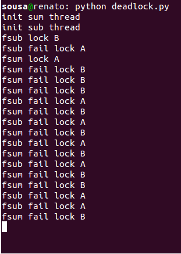
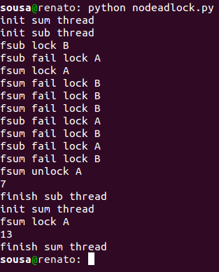

# Deadlock Version

O que ocorre é uma espera circular. A função ***fsum*** possui o recurso **A**, e precisa do recurso **B** para terminar a sua tarefa. Já a função ***fsub*** possui o recurso **B** e precisa do recurso **A** para terminar a sua tarefa.

Como nenhuma das duas funções conseguem terminar a sua tarefa, e não liberam os recursos, ocorre uma espera circular e as duas threads nunca terminam (ficam tentando infinitamente pegar o recuso que falta para concluir a sua tarefa).

Na imagem abaixo, temos um exemplo da execução das duas threads.

# No Deadlock Version
Para corrigir a espera circular citada no caso acima, foi necessário fazer pequenas alterações para que uma função não ficasse em espera para sempre (até que a outra libere o recurso).

Agora ***fsum***, em posse do recurso **A**, faz **5** tentativas para conseguir o recurso **B**, se não o conseguir, libera **A** e reinicia a função após alguns segundos.

